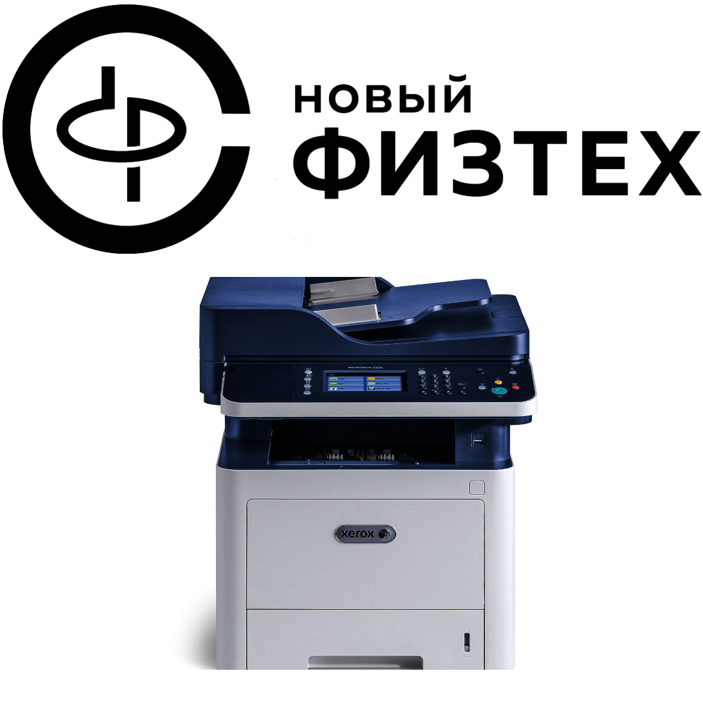

# New Phystech Printers Telegram Bot



Telegram bot that helps faculty members of New Phystech work with faculty's public printers.

This bot can:

- Print text directly from chat
- Print PDF files
- Ask to convert non-PDF files to PDF and then print them

To activate the bot, please do this:

```
python -m venv venv
. venv/bin/activate
pip install -r requirements.txt
python main.py
```

Licensed under GNU General Public License v3.0.
